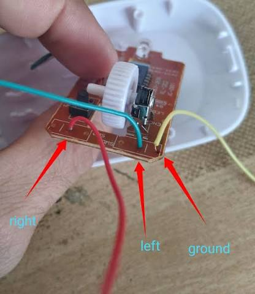
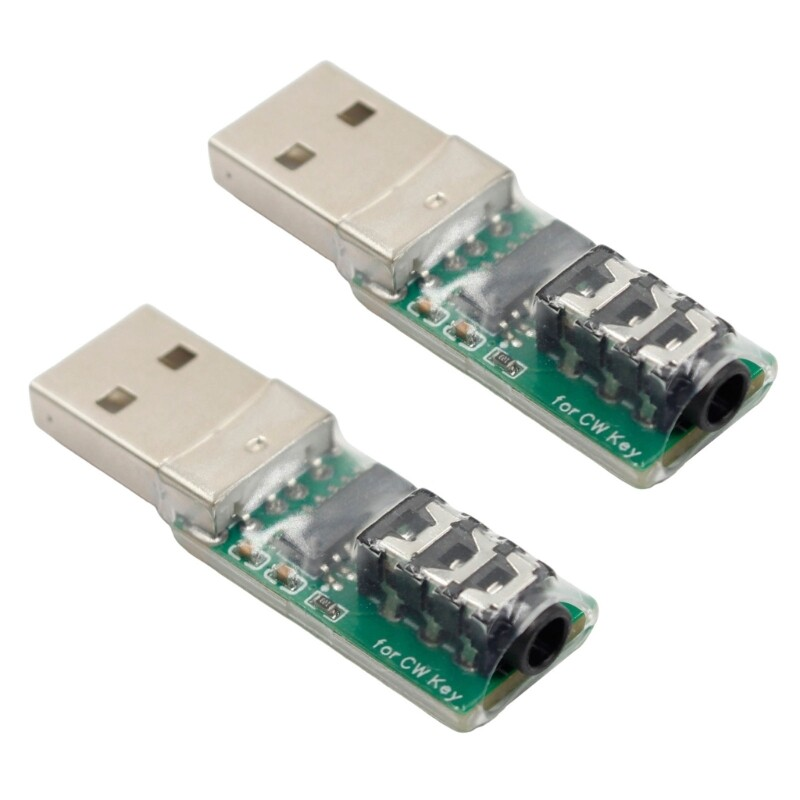

# 📡 Morse Practice

> **Free • Open Source • Browser-Based Morse Code Training Platform**

🇪🇸 **¿Prefieres leer las instrucciones en español?** Consulta la [guía completa en español](README-ES.md).

## 🚀 [TRY IT NOW — OPEN MORSE PRACTICE](https://zp5dxs.github.io/morse-practice/)

> **No installation · No registration · 100% free · Start training directly in your browser.**

[](https://zp5dxs.github.io/morse-practice/)

## 🎥 Complete Morse Practice Tutorial

[](https://youtu.be/J2wu3eOUZkg)

▶ **[Watch the complete tutorial on YouTube](https://youtu.be/J2wu3eOUZkg)**

Practice, learn and improve Morse code directly from your browser using
your **keyboard**, **mouse**, **touchscreen**, **commercial USB key**,
**DIY USB adapters**, or **Arduino HID interfaces**.

Morse Practice combines:

- CW oscillator and sidetone
- Real-time Morse decoder
- Text-to-CW playback
- Straight key and paddle practice
- Adjustable WPM
- Adjustable Farnsworth character spacing
- Adjustable word spacing
- Adjustable **Band Noise** for a more radio-like listening environment
- Global **Visual Aid** control
- Global **Audio Only** mode for ear-only practice
- Hold **W** for a temporary visual peek while Audio Only is active
- CW Racer
- Progressive 40-lesson Koch Course
- Cumulative Koch listening Challenges
- Adaptive character training
- Custom Lessons from any text
- Character-by-character lessons
- Word-by-word lessons
- Independent local Statistics dashboard
- Learn From My Mistakes adaptive training
- Daily sending exercises
- Worldwide ON AIR practice room
- Simulated QSO training
- POTA practice
- SKCC practice
- Local AI-assisted QSO interpretation
- Simulated QSB, QRM and repeat requests
- Multiple simulated CW operator styles
- Multiple visual themes: Blue, Green, Purple, Pink and Game Boy
- Community-wide visitor, country and total practice-hour statistics
- Global **73!** appreciation counter
- Optional **Weekly Leaderboard** with callsign, rank, points and streak
- Global operator callsign shared across community features
- **Rewards** system with unlockable themes and achievements
- SKCC and LICW community membership badges with global onboard counts
- Practice streak rewards for 7 and 30 consecutive days
- Top 10 weekly leaderboard achievement
- Special unlockable themes: Brass Key, LICW Night, CW Heritage, Master
  Copy, Signal Green and Night Operator
- VBand-style keyboard input support using Left/Right Ctrl and bracket
  keys
- Optional **DIT / DAH inversion** for left-handed or reversed paddle
  setups
- **CW Duel** — realtime head-to-head Morse copying battles at 8, 15 or
  20 WPM
- **CW Invaders** — arcade-style TX/RX practice with letters, numbers, mixed characters and CW words
- **CW Flappy** — arcade-style CW practice for short, repeatable training sessions
- **CW Timing** — dedicated trainer for CW sending rhythm and timing
- **CW Battleship** — naval-themed listening and sending game with Cadet, Operator and Contester levels
- **World Record / Ben’s Best Bent Wire** — continuous-speed sending challenge with Practice and Ranked modes
- **CW Racer Timed mode** — race against the clock for 30, 60 or 120 seconds
- Global lightweight **Chat** with optional Auto CW playback and text
  hiding
- Global accumulated **CW Duel** counter in the community footer

**No installation required. No registration required. Completely free
and open source.**

Most training data remains local to your browser. Community features
such as ON AIR, global usage statistics, 73! and the optional Weekly
Leaderboard use lightweight shared realtime data only where needed.

🌐 **Ready to practice?**

### 🚀 [Click here to start training now](https://zp5dxs.github.io/morse-practice/)

🎥 [Complete tutorial on YouTube](https://youtu.be/J2wu3eOUZkg)

------------------------------------------------------------------------

# 👋 About

Hello!

My name is **Mathias Maidana (ZP5DXS)** 🇵🇾.

I'm an Amateur Radio operator from Paraguay and a passionate CW
enthusiast.

I'm currently a student of the **Long Island CW Club (LICW)**, where I
discovered how enjoyable and rewarding learning Morse code can be thanks
to incredible instructors and an amazing worldwide community.

Morse Practice is an independent personal project that was born during
that learning journey.

The original goal was very simple:

> **"Open a browser and start practicing immediately."**

I wanted something that could be used from the very beginning — even
before owning a key, paddle or oscillator.

Over time, the project evolved into a complete browser-based CW training
environment.

Today you can use it to:

- Learn Morse characters
- Follow a complete progressive Koch course
- Complete cumulative listening Challenges
- Practice sending
- Practice receiving
- Hear how text should sound in CW
- Decode your own sending
- Practice with a straight key or paddle
- Use a mouse, keyboard or touchscreen
- Race against yourself
- Create lessons from your own text
- Practice character by character
- Practice word by word
- Track your progress
- Identify your weakest characters
- Generate practice based on your mistakes
- Complete daily sending exercises
- Adjust Farnsworth character spacing
- Practice live with other operators around the world
- Practice complete simulated QSOs
- Train basic, intermediate and advanced exchanges
- Practice POTA exchanges
- Practice SKCC exchanges
- Experience QSB, QRM and repeat requests
- Practice copying and responding to different CW operating styles
- Monitor your activity from a unified Statistics dashboard
- Practice with all visual CW clues hidden using Audio Only mode
- Add a controlled amount of simulated receiver/band noise
- Change the complete visual accent theme of the platform
- See global community statistics
- Send a simple **73!** to the project
- Join an optional weekly CW leaderboard and compare your progress with
  other operators
- Use one global callsign across ON AIR, Leaderboard and Rewards
- Unlock cosmetic rewards for progress, streaks and community
  memberships
- See how many SKCC and LICW members are using Morse Practice
- Invert DIT and DAH when using a paddle
- Challenge another operator in realtime CW Duel
- Play CW Invaders in TX or RX mode
- Train with **CW Flappy** in an arcade-style format
- Practice sending rhythm and timing with **CW Timing**
- Play CW Battleship at 12, 18 or 25 WPM
- Take the World Record / Ben’s Best Bent Wire continuous-speed challenge
- Run CW Racer as a fixed Sprint or a 30/60/120-second Timed race
- Organize the desktop workspace by reordering or hiding modules without changing their underlying functions
- Find a random Duel opponent or challenge a specific available operator
- Use the global text Chat and optionally copy incoming messages by ear
  in CW

And you can do all of this directly from a browser.

If this project helps even one new operator get closer to CW, practice a
little more, or simply have fun sending Morse code, then it has already
achieved its purpose.

**73!**

------------------------------------------------------------------------

# ❤️ Philosophy

Learning Morse code should not require expensive equipment.

Whether you own:

- a professional paddle,
- a straight key,
- an Arduino,
- a USB adapter,
- an old mouse,
- a wireless mouse,
- a tablet,
- a phone,
- or just a laptop...

...you should be able to practice CW.

Morse Practice is designed around that idea.

You can start with absolutely nothing except a browser and gradually
move toward real keys, paddles and radio equipment as your skills
improve.

------------------------------------------------------------------------

# ✨ Main Features

## 🎹 Multiple Input Devices

✔ Computer Keyboard  
✔ USB Mouse  
✔ Wireless Mouse  
✔ Touch Screen  
✔ Straight Key  
✔ Paddle / Iambic Paddle  
✔ Commercial USB Adapters  
✔ DIY USB Adapters  
✔ Arduino USB HID  
✔ VBand-style keyboard interfaces  
✔ Left / Right Ctrl paddle input  
✔ `[` / `]` bracket paddle input

------------------------------------------------------------------------

# 🎧 CW Audio

✔ Adjustable Sidetone Frequency  
✔ Adjustable Volume  
✔ Adjustable WPM  
✔ Adjustable Character Spacing / Farnsworth  
✔ Adjustable Word Spacing  
✔ Adjustable Band Noise from 0–30%  
✔ Real-time Tone Generation  
✔ Local browser audio

The CW tone is generated directly by your browser, providing immediate
feedback while sending.

Band Noise is also generated locally with the browser audio engine. It
adds a filtered noise bed intended to make listening feel a little
closer to an HF receiver without requiring any external audio files.

------------------------------------------------------------------------

# ⏱ WPM and Farnsworth Spacing

Morse Practice separates **character speed** from **character spacing**.

This is especially useful for beginners.

The selected **WPM** controls the real speed of the Morse character
itself.

For example, the DITs and DAHs of:

``` text
K
-.-
```

continue to sound at the selected WPM.

The **Character Spacing / Farnsworth** control adds additional time
**between characters** without slowing down the internal rhythm of each
character.

This allows you to learn the sound of complete Morse characters at a
realistic speed while giving your brain additional time to recognize
them.

Example:

``` text
Normal spacing:

K M R A

Farnsworth spacing:

K     M     R     A
```

The characters themselves are not stretched.

Only the silence between them changes.

Word spacing remains independently adjustable.

The global WPM, Farnsworth spacing and word spacing are used throughout
the platform where applicable, including:

- Text → CW
- CW Racer
- Daily
- Custom Lessons
- Koch Course
- Koch Challenges
- QSO Bot playback

------------------------------------------------------------------------

# 📻 Band Noise

Morse Practice includes an optional global **Band Noise** control.

The slider ranges from:

``` text
0% → 30%
```

At **0%**, the platform behaves exactly like a clean CW oscillator.

Increasing the level adds filtered local noise behind the CW tone to
create a more radio-like listening environment.

The noise is generated directly in the browser using Web Audio.

No external sound file is streamed or downloaded.

This feature is intentionally simple:

- It does not simulate an entire receiver
- It does not automatically create QRM
- It does not change your CW timing
- It does not modify decoded text
- It simply adds a controllable background noise layer

The selected Band Noise level is remembered locally by your browser.

------------------------------------------------------------------------

# 📝 CW Trainer

✔ Real-time Morse Decoder  
✔ Text → CW Playback  
✔ CW → Text Decoding  
✔ Keyboard Practice  
✔ Straight Key Practice  
✔ Paddle Practice  
✔ Mouse Practice  
✔ Touch Practice  
✔ Visual DIT/DAH Assistance  
✔ Audio Only / Ear-Only Practice  
✔ Hold W to Peek  
✔ Mobile Friendly

The main trainer can be used simply as a CW oscillator or as a complete
sending practice environment.

------------------------------------------------------------------------

# 🚀 Getting Started

Simply visit:

<https://zp5dxs.github.io/morse-practice/>

Choose your preferred input method and start practicing immediately.

For your first practice session, you can use nothing more than:

- your keyboard,
- your mouse,
- or your phone screen.

No Morse key is required.

------------------------------------------------------------------------

# 📖 Basic Instructions

## 🔑 Straight Key

Select:

**Straight Key**

You can operate using:

- Mouse
- Touch Screen
- Keyboard
- Straight Key
- USB Adapter

Press to transmit.

Release to stop.

The duration of your press determines whether the signal is interpreted
as a DIT or DAH.

This makes Straight Key mode ideal for practicing your actual sending
rhythm.

------------------------------------------------------------------------

# 🎹 Paddle

Select:

**Paddle**

Desktop users can operate with a mouse or compatible hardware paddle.

On mobile devices, the keying area automatically becomes a two-sided
paddle.

🔵 **Left → DIT**

🟢 **Right → DAH**

The application supports simultaneous touches, allowing iambic operation
directly from a touchscreen.

This means a phone or tablet can become a simple virtual CW paddle.

## ↔ Invert DIT / DAH

When **Paddle** mode is selected, Morse Practice also provides an
optional:

**Invert DIT / DAH**

control in the keying area.

This swaps the paddle sides:

``` text
Normal:
Left  → DIT
Right → DAH

Inverted:
Left  → DAH
Right → DIT
```

This is useful for left-handed operators and for physical paddles or USB
interfaces wired in the opposite orientation.

The setting affects paddle input only and can be changed at any time.

------------------------------------------------------------------------

# 📱 Mobile Practice

Morse Practice is designed to work on mobile devices.

You can practice directly from:

- Android phones
- iPhones
- Tablets
- Touchscreen computers

This makes short practice sessions possible almost anywhere.

Waiting somewhere for five minutes?

Open Morse Practice and run a short CW Race.

Want to exchange some Morse with another operator?

Join ON AIR.

Want to hear how a callsign or word sounds?

Type it and press **Play CW**.

Want to practice a simulated contact?

Start the **QSO Bot**.

Want to continue learning characters progressively?

Open the **Koch Course**.

The idea is to make CW practice something you can do whenever you have a
few free minutes.

------------------------------------------------------------------------

# ▶ Text → CW Playback

Type any text into the text box.

Press:

**▶ Play CW**

The application transmits the message using your currently selected:

- WPM
- Tone
- Volume
- Character spacing / Farnsworth
- Word spacing

This is useful for quickly hearing how:

- Callsigns
- Words
- Abbreviations
- Phrases
- QSO exchanges

sound in Morse code.

------------------------------------------------------------------------

# 🔤 CW Decoder

Everything you transmit can be decoded in real time.

This provides immediate visual feedback while practicing.

It is especially useful for beginners because you can instantly compare
what you intended to send with what the application actually decoded.

The decoder also recognizes supported punctuation and common prosigns
such as:

- **AR**
- **BT**
- **SK**
- **AS**
- **SOS**

------------------------------------------------------------------------

# 👁 Visual DIT / DAH Assistance

Visual Morse symbols can be enabled or disabled globally.

When enabled, the application displays the DITs and DAHs as you
transmit.

For example:

``` text
. - . .
```

Beginners may find this useful while learning the relationship between
keying and Morse patterns.

More experienced operators can disable visual assistance and practice
entirely by ear.

The same setting also affects training modules such as **CW Racer
Learn** and **Koch**, so the visual Morse pattern can be hidden
throughout the platform.

------------------------------------------------------------------------

# 🎧 Audio Only Mode

For operators who want to practice completely by ear, Morse Practice
includes a global:

**Audio Only**

mode.

When Audio Only is enabled, the application continues decoding and
processing CW internally, but hides visual information that could reveal
what is being transmitted.

Depending on the active module, this can include:

- DIT / DAH patterns
- Decoded characters
- Characters you are sending
- Koch target characters
- CW Racer visual answers
- Custom Lesson target information
- QSO Bot transmitted text
- QSO Bot callsign hints
- ON AIR transmitting operator identification while the transmission is
  active
- The callsign in the ON AIR **Channel Busy** indication

The important point is:

> **The CW engine still knows what happened. The user simply does not
> see the answer.**

This means evaluation, statistics, QSO interpretation, Koch progression
and other internal logic continue working normally.

When Audio Only is active, Visual Aid is temporarily forced off.

When Audio Only is disabled, your previous Visual Aid preference is
restored.

## 👁 Hold W to Peek

While Audio Only is active, you can hold:

**W**

for a temporary visual peek.

The hidden information becomes visible only while the key is held.

Release **W** and the interface returns immediately to Audio Only mode.

This is useful when you want to check what you copied without
permanently turning visual assistance back on.

On text-entry fields, the W key remains available for normal typing.

------------------------------------------------------------------------

# ✍️ Custom Lessons

Morse Practice can turn almost any text into a structured CW lesson.

Paste your text into the main text area and activate:

**Custom Lesson**

You can choose between two modes:

- **Character by Character**
- **Word by Word**

This makes it possible to build personalized exercises without creating
lesson files or configuring a database.

------------------------------------------------------------------------

## 🔤 Character-by-Character Mode

The lesson breaks the pasted text into individual Morse characters.

For example:

``` text
RADIO
```

becomes:

``` text
R
A
D
I
O
```

The application presents each target and waits for you to transmit it.

Your sending is evaluated using the same timing and accuracy system used
by CW Racer.

### 🟢 Correct

Good character and timing.

### 🟡 Correct — Timing Can Improve

The Morse sequence is correct but your timing can be improved.

### 🔴 Incorrect

The character must be repeated.

Each result contributes to your global character statistics.

------------------------------------------------------------------------

## 📝 Word-by-Word Mode

Word Mode uses complete words as training units.

For example:

``` text
CQ POTA DE ZP5DXS
```

becomes:

``` text
CQ
POTA
DE
ZP5DXS
```

The application plays or presents the word and expects you to transmit
the complete word.

Every character inside the word is evaluated individually.

If a character is incorrect, the system can identify the position of the
error and repeat the complete word.

This is especially useful for practicing:

- Callsigns
- Common QSO words
- Abbreviations
- Contest exchanges
- POTA exchanges
- SKCC exchanges
- Class exercises
- Technical vocabulary
- Personal practice texts

The original pasted text remains available while you practice.

------------------------------------------------------------------------

# 🏁 CW RACER

CW Racer turns Morse practice into an interactive training system.

Instead of simply listening to characters, **you must send them
yourself**.

The objective is to combine:

- Character recognition
- Auditory memory
- Actual keying
- Timing
- Accuracy
- Consistency

CW Racer contains three dedicated training sections:

- 🎓 **Learn**
- 🏁 **Race**
- 📅 **Daily**

Statistics are available through the independent **📊 Statistics**
module.

------------------------------------------------------------------------

# 🎓 Learn Mode

Learn Mode is designed for practicing individual Morse characters.

Select a character group:

- Letters
- Numbers
- Punctuation
- Prosigns
- Mixed

The application presents a character and waits for you to transmit it.

For example:

``` text
A
.-
```

If global Visual Aid is disabled, the Morse pattern is hidden.

You can optionally:

🔊 **Hear the character in Morse**

or

🗣 **Hear the character spoken by your device**

Then transmit it using your selected input method.

The application analyzes your transmission and provides immediate
feedback.

------------------------------------------------------------------------

# 🟢🟡🔴 Scoring System

CW Racer uses a simple visual scoring system.

### 🟢 Green — Correct

The character was transmitted correctly with good timing.

**+1 point**

The trainer moves to the next character.

### 🟡 Yellow — Correct, but timing can improve

The Morse sequence was correct, but your DIT/DAH timing could be
improved.

**+0.5 points**

The trainer continues while recording that character as one that may
need additional practice.

### 🔴 Red — Incorrect

The character was transmitted incorrectly.

**0 points**

The character must be repeated.

This creates a simple learning loop:

> **See → Hear → Send → Receive Feedback → Improve**

------------------------------------------------------------------------

# 🏁 Race Mode

Race Mode transforms CW sending practice into a challenge.

Choose your character set:

- Letters
- Numbers
- Punctuation
- Prosigns
- Mixed

Then select the race length:

- 20 characters
- 50 characters
- 100 characters

Press:

**🏁 Start Race**

The application presents characters one after another.

Your objective is to transmit them as accurately as possible.

Each race has a fixed number of exercises and automatically ends when
the selected distance is completed.

------------------------------------------------------------------------

# 🏆 Race Score

At the end of the race, Morse Practice displays your result.

Example:

``` text
🏁

Final Score: 43.5 / 50

Best Similar Race: 46 / 50
```

Your best result is compared against races using the same:

- Character category
- Race length
- WPM

This means you can gradually compete against your own previous
performance.

The objective is not simply speed.

The objective is:

> **Speed + Accuracy + Consistency**

------------------------------------------------------------------------

# 📅 Daily

The Daily section provides structured sending exercises that can be
repeated regularly as a CW warm-up.

It is based on the Morse sending exercise created by **Bob Carter,
WR7Q**.

The Daily module contains three sections:

### 🔥 Warm Up

Short patterns designed to get your hand moving and establish rhythm
before more complex sending.

### ✍️ Exercise

Structured sequences designed to practice transitions between different
Morse characters.

### 🎯 Drill

Longer and more demanding sequences combining characters, numbers,
punctuation and prosigns.

The objective is not to race.

The objective is to develop:

- Rhythm
- Consistency
- Character transitions
- Accurate spacing
- Reliable sending

If you make a mistake during a Daily unit, repeat the unit and try
again.

Daily can be useful as a regular warm-up before:

- CW practice
- LICW sessions
- Getting on the air
- Contests
- POTA activations
- Ragchewing
- Straight-key practice

Results also contribute to your character statistics.

**Exercise by WR7Q**

------------------------------------------------------------------------

# 🎮 CW GAMES & CHALLENGES

Morse Practice now includes several game-style activities designed to turn sending and receiving practice into short, repeatable challenges. They use the same CW engine and global practice settings where applicable.

## 👾 CW Invaders

An arcade-style Morse game with dedicated **TX** and **RX** modes. Choose letters, numbers, mixed characters or common CW words, select a difficulty level, and try to clear incoming targets while building score and preserving your lives.

## 🐦 CW Flappy

An arcade-style CW practice game designed for short, repeatable sessions. It adds another playful way to train Morse inside the same platform.

## ⏱ CW Timing

A dedicated module for working on **sending rhythm and timing**. It provides focused practice on CW temporal consistency and complements the accuracy and sending exercises available elsewhere in Morse Practice.

## ⚓ CW Battleship

A naval-themed CW challenge that combines copying and sending inside a visual battle scenario. Three preset levels are available: **Cadet (12 WPM)**, **Operator (18 WPM)** and **Contester (25 WPM)**. The game tracks score, combo, waves, lives and ships sunk.

## 🌍 World Record / Ben’s Best Bent Wire

A continuous-speed sending challenge inspired by the classic **Ben’s Best Bent Wire** exercise. It includes a normal **Practice** mode and a **Ranked** mode for competitive attempts. The objective is to keep the sequence moving accurately as speed and pressure increase.

## ⏱ CW Racer — Sprint & Timed

CW Racer now offers two race formats. **Sprint** keeps the traditional fixed distances of 20, 50 or 100 characters, while **Timed** gives you 30, 60 or 120 seconds to send as accurately as possible.

------------------------------------------------------------------------

# 🧩 Modular Desktop Workspace

On wider desktop screens, Morse Practice uses a modular workspace. Training and community modules can be **reordered or hidden** from the desktop module rail, allowing each operator to keep the tools they use most within easy reach. This is a layout feature only: hiding or moving a module does not remove its data or change its internal logic.

------------------------------------------------------------------------

# 📚 KOCH COURSE

Morse Practice includes a complete progressive **Koch-style CW learning
course**.

The objective is different from CW Racer.

CW Racer lets you choose what you want to practice.

Koch Course provides a **structured path from the beginning to the
complete character set**.

The course contains:

✔ 40 progressive lessons  
✔ Listening practice  
✔ Sending practice  
✔ Progressive character introduction  
✔ Cumulative review  
✔ Three-star scoring  
✔ Local progress storage  
✔ Automatic level unlocking  
✔ Periodic CW Challenges  
✔ Integration with global Statistics

------------------------------------------------------------------------

# 🧠 How the Koch Course Works

The first lesson begins with a very small character set.

New characters are introduced gradually.

Conceptually:

``` text
Lesson 01
K + M

Lesson 02
K M + U

Lesson 03
K M U + R

Lesson 04
K M U R + E
```

and so on.

Each lesson continues reviewing characters from previous lessons while
introducing the new one.

The new character receives additional exposure so that it does not
become lost inside the growing character pool.

------------------------------------------------------------------------

# 🎧 Part 1 — Listen and Send

Each Koch lesson begins with a **Listen and Send** block.

The application sends a character in Morse.

You do not simply identify it visually.

You must copy it by ear and then transmit that same character yourself.

Conceptually:

``` text
Browser sends:
-.-
```

You recognize:

``` text
K
```

and then transmit:

``` text
-.-
```

The application evaluates both the character and your sending timing.

This combines:

- Morse reception
- Character recognition
- Auditory memory
- Actual sending

------------------------------------------------------------------------

# 👂 Part 2 — Listen and Select

After the transmission section, the lesson changes to pure reception
practice.

The application plays a Morse character.

You choose the character you heard from the available options.

For example:

``` text
🔊 MORSE AUDIO

[K]   [M]
[U]   [R]
```

Only characters already learned in the course are used as normal lesson
options.

This keeps the course progressive and avoids testing characters that
have not yet been introduced.

------------------------------------------------------------------------

# ⭐ Koch Lesson Scoring

Each lesson receives between zero and three stars.

### ⭐

Approximately 70% or better.

### ⭐⭐

Approximately 80% or better.

### ⭐⭐⭐

**90% or better.**

Achieving **90%** is the mastery target used to unlock the next Koch
lesson.

Example:

``` text
Lesson 08

Accuracy: 93%

⭐⭐⭐

Next lesson unlocked
```

If the result is lower, the lesson can simply be repeated.

Your best result is saved locally.

------------------------------------------------------------------------

# 🎧 CW Challenges

Every three Koch lessons, Morse Practice provides a cumulative **CW
Challenge**.

These Challenges focus entirely on **reception**.

They do not introduce new characters.

Instead, they test how well you remember everything learned so far.

Example:

``` text
Lessons 01–03
        ↓
🎧 CW Challenge 01
```

Later:

``` text
Lessons 04–06
        ↓
🎧 CW Challenge 02
```

Each Challenge uses characters from the complete set learned up to that
checkpoint.

Recent characters receive somewhat more exposure, while earlier
characters continue to appear.

This helps prevent older characters from being forgotten as the course
grows.

------------------------------------------------------------------------

# 🎯 Challenge Format

A Challenge contains a series of listening exercises.

The application sends a character and provides up to four choices.

Example:

``` text
🔊

[C]   [K]
[R]   [N]
```

Choose the character you copied.

Challenge performance is scored using the same star system.

Unlike the normal Koch lessons, **Challenges are diagnostic checkpoints
and do not block your progress through the course**.

Their purpose is to answer a simple question:

> **Am I still copying the characters I learned earlier?**

------------------------------------------------------------------------

# 🏆 Final Koch Challenge

After progressing through the course, a final cumulative listening
challenge becomes available.

This provides an opportunity to review the complete learned character
set.

The Koch Course therefore creates a complete progression:

``` text
Learn
 ↓
Listen
 ↓
Send
 ↓
Review
 ↓
Challenge
 ↓
Add new characters
 ↓
Repeat
```

until the complete course is finished.

------------------------------------------------------------------------

# 💾 Koch Progress

Koch progress is stored locally in your browser.

The application remembers:

- Current lesson
- Unlocked lessons
- Best lesson accuracy
- Stars earned
- Completed Challenges
- Challenge scores
- Course completion

No account or cloud database is required.

You can reset the course at any time using:

**Reset Koch Progress**

------------------------------------------------------------------------

# 📊 STATISTICS

Statistics are no longer limited to CW Racer.

The independent **Statistics** module acts as the central local progress
dashboard for Morse Practice.

Opening or closing Statistics does **not** interrupt:

- ON AIR
- QSO Bot
- Koch
- Racer
- Other practice modes

It is purely a visual dashboard.

------------------------------------------------------------------------

# 🔤 Character Performance

The most important part of Statistics remains individual character
performance.

Each character develops its own local profile based on your practice.

Characters are displayed using the familiar system:

🟢 **Strong**

🟡 **Needs improvement**

🔴 **Weak**

Performance can be influenced by activities such as:

- CW Racer Learn
- CW Racer Race
- Daily
- Custom Lessons
- Koch lessons
- Koch listening exercises
- Koch Challenges

This means your statistics gradually become a broader picture of your
real CW strengths and weaknesses.

------------------------------------------------------------------------

# 🧠 Learn From My Mistakes

One of the most useful features of the Statistics module is adaptive
practice.

Select:

**🧠 Learn From My Mistakes**

Morse Practice analyzes your local character statistics and builds a
lesson that gives greater priority to weaker characters.

For example:

``` text
A 🟢
N 🟢
K 🟢
F 🟡
Q 🔴
Y 🔴
```

The adaptive practice session will give greater priority to:

``` text
Q
Y
F
```

while still periodically checking stronger characters such as:

``` text
A
N
K
```

The objective is to gradually balance your character proficiency.

Because Custom Lessons, Koch and other evaluated exercises also feed the
character statistics, the adaptive trainer can learn from mistakes made
across multiple parts of the platform.

------------------------------------------------------------------------

# 📈 Activity Dashboard

Statistics also includes a compact activity overview.

The dashboard can track activity across modules such as:

- CW Racer
- Daily
- Koch Lessons
- Koch Challenges
- Custom Lessons
- Simulated QSOs

The local Statistics dashboard is focused on your own progress.

It provides a quick visual indication of how you are using Morse
Practice.

A separate optional **Weekly Leaderboard** is available for operators
who want a community challenge.

------------------------------------------------------------------------

# 💾 Local Statistics

Statistics are stored directly in your browser.

This means:

- No account
- No login
- No cloud database
- No personal information required

Your browser remembers your progress automatically.

You can reset your statistics at any time using:

**Reset Statistics**

⚠️ Clearing your browser storage may also remove your saved statistics,
Koch progress and local preferences.

------------------------------------------------------------------------

# 🌐 Community Statistics

In addition to your private local Statistics dashboard, Morse Practice
displays a small set of **global community statistics**.

These numbers represent the accumulated activity of the Morse Practice
community, not your personal statistics.

The footer can display values such as:

``` text
🌐 Morse Practice — Community Statistics

👥 Unique visitors
🌎 Countries
⏱ Total practice hours
⚔️ CW Duels
❤️ 73!
```

## 👥 Unique Visitors

Each browser receives a random anonymous local identifier.

This allows the community counter to estimate unique browsers without
requiring:

- Registration
- Login
- Name
- Email
- Callsign

The identifier is stored locally in the browser.

## 🌎 Countries

Morse Practice can use a lightweight country lookup to count how many
different countries have used the platform.

The global counter stores the country code needed for aggregation.

It is not intended to create personal location profiles.

## ⏱ Total Practice Hours

This number is the **accumulated active practice time of all
participating browsers**.

It is not simply the amount of time the page has been left open.

Practice time is accumulated only while recent training/keying activity
is detected.

So:

``` text
⏱ 420.5 total practice hours
```

means approximately **420.5 hours practiced collectively by the Morse
Practice community**.

It does **not** mean that you personally practiced 420.5 hours.

## ⚔️ CW Duels

The footer also includes a global accumulated **CW Duel** counter.

Each completed Duel contributes to this community total.

Unlike the Weekly Leaderboard, this value is not intended to reset every
week. It represents the accumulated number of completed battles recorded
by the shared community statistics.

## ❤️ 73!

The footer also includes a simple global appreciation button:

**❤️ 73!**

Each browser can send it once.

It is simply a small community gesture — the amateur-radio version of a
lightweight “like”.

No account is required.

------------------------------------------------------------------------

# 🏆 Weekly Leaderboard

Morse Practice also includes an optional **Weekly Leaderboard**.

The Leaderboard is separate from your private Statistics dashboard.

You can open it simply to see the current ranking without participating.

Participation is voluntary.

To join, enter your:

**Callsign**

and submit it to the weekly ranking.

The platform can then display:

- Weekly position
- Weekly points
- Current/best streak used by the ranking
- Callsign
- Country flag when available
- Other participating operators

The weekly ranking uses a new week identifier automatically, so each new
week begins a new comparison period.

Your detailed training history remains local.

Only the compact information required for the leaderboard is shared.

## 📊 Weekly Points

Weekly points are derived from local activity during the current week.

The current scoring model combines several transparent activity sources:

- **+1** for each correct CW Racer character
- **+1** for each active practice minute
- **+20** for each completed simulated QSO
- **+5** for each completed CW Duel
- **+10 additional points** for each Duel win

Competitive correct-answer streaks from **CW Racer** and **CW Duel** can
also update the weekly streak shown in the ranking.

The objective is not to reward WPM alone.

It is intended to reward **regular practice, accuracy and
participation**.

## ✏️ Change Callsign

If you are already participating, you can choose:

**Change Callsign**

and enter a different callsign.

Your local practice data remains on the same browser.

Future leaderboard updates use the newly selected callsign.

## 🚪 Leave the Leaderboard

You can also choose:

**Leave Leaderboard**

at any time.

This stops that browser from publishing new weekly leaderboard updates.

A result that was already published during the current week may remain
visible to other users until that weekly dataset is no longer the active
one.

You can rejoin later with the same callsign or a different callsign.

No account is created.

> The Weekly Leaderboard is a friendly practice feature, not an official
> contest or award system.

------------------------------------------------------------------------

# 📡 Global Operator Callsign

Morse Practice uses a single operator callsign across community-oriented
features.

In Spanish the field is shown as:

**Indicativo**

In English:

**Callsign**

The objective is simple: you should not have to enter the same callsign
separately in different modules.

The saved operator identity can be reused by:

- ON AIR
- CW Duel
- Global Chat
- Weekly Leaderboard
- Rewards
- Other community features that may need an operator identity

You can edit it at any time.

Changing the callsign does not reset your local CW training statistics
or Koch progress.

------------------------------------------------------------------------

# 🏆 Rewards

Morse Practice includes an optional **Rewards** system.

Rewards are cosmetic.

They do not provide:

- Extra points
- Easier exercises
- Hidden CW assistance
- Competitive advantages

Instead, achievements unlock visual themes and small status markers.

The idea is simple:

> **Practice and participation unlock cosmetics — never advantages.**

The Rewards module shows which achievements are locked and which have
already been completed.

------------------------------------------------------------------------

# 🔑 SKCC Member Reward

If you are already a member of the **Straight Key Century Club**, you
can add your SKCC number inside Rewards.

The number is stored locally in your browser.

Adding it unlocks:

**🔑 Brass Key**

a dark brass / vintage key-inspired theme.

The Rewards module can also show the total number of Morse Practice
users who have identified themselves as SKCC members.

For example:

``` text
SKCC #31269
84 members aboard
```

This count refers only to SKCC members who have added their membership
inside Morse Practice.

It is **not** the total membership of SKCC.

You can edit or remove your SKCC number at any time.

If you remove it:

- The SKCC reward becomes locked again
- Brass Key becomes unavailable
- If Brass Key is currently active, Morse Practice returns to the
  default Blue theme

------------------------------------------------------------------------

# 🌊 LICW Member Reward

Students and members of the **Long Island CW Club** can add their LICW
number inside Rewards.

Adding it unlocks:

**🌊 LICW Night**

a blue / cyan theme inspired by the LICW community.

Like SKCC, the Rewards module can display how many Morse Practice users
have identified themselves as LICW members:

``` text
LICW #12345
42 members aboard
```

The membership number itself remains a local preference.

You can edit or remove it at any time.

Removing the number disables the corresponding reward theme.

------------------------------------------------------------------------

# 📻 CW Heritage

Operators who add **both** an SKCC number and an LICW number unlock:

**📻 CW Heritage**

This theme is intended as a small tribute to two communities strongly
connected with learning, practicing and preserving CW.

If either membership is removed later, CW Heritage becomes locked again.

------------------------------------------------------------------------

# 🎧 Master Copy

Completing all cumulative Koch Challenges unlocks:

**🎧 Master Copy**

This reward recognizes progression through the complete listening-review
path of the Koch course.

It is tied to Koch Challenge completion rather than raw WPM.

------------------------------------------------------------------------

# 🔥 7 Day Streak

Practicing on **7 consecutive days** unlocks:

**🟢 Signal Green**

The streak is based on actual active-practice days recorded locally by
Morse Practice.

It is a calendar-day streak:

``` text
Day 1
Day 2
Day 3
...
Day 7
```

Missing a day breaks the active streak.

The reward is not based on your best CW Racer character streak.

It represents consistent practice over multiple days.

------------------------------------------------------------------------

# ⚡ 30 Day Streak

Practicing on **30 consecutive days** unlocks:

**🌙 Night Operator**

This is intended as one of the more demanding long-term rewards.

Like the 7-day reward, it is based on consecutive active-practice days
rather than speed or score.

------------------------------------------------------------------------

# 🏅 Top 10 Operator

Reaching the **Top 10** of the Weekly Leaderboard unlocks the:

**🏅 Top 10 Operator**

achievement.

This is primarily a recognition badge rather than another theme.

The Weekly Leaderboard remains informal and should be treated as a
friendly community challenge rather than an official contest.

------------------------------------------------------------------------

# ✨ Reward Notifications

When a reward is unlocked, Morse Practice displays a small visual
notification.

If several achievements unlock at almost the same time, they are
displayed one after another rather than overlapping.

For example, adding a second community membership may unlock:

``` text
LICW Reward
        ↓
CW Heritage
```

Each notification receives its own display time.

------------------------------------------------------------------------

# 🎨 Unlockable Reward Themes

In addition to the standard themes, Rewards can unlock:

- 🔑 **Brass Key** — SKCC membership
- 🌊 **LICW Night** — LICW membership
- 📻 **CW Heritage** — SKCC + LICW
- 🎧 **Master Copy** — all Koch Challenges
- 🟢 **Signal Green** — 7-day practice streak
- 🌙 **Night Operator** — 30-day practice streak

Locked reward themes remain visible in the theme selector with a lock
indicator.

This allows operators to see what can still be earned.

------------------------------------------------------------------------

# 🤖 QSO BOT

QSO Bot allows you to practice complete simulated CW contacts directly
in your browser.

Instead of following a fixed text lesson, you interact with a simulated
radio operator.

The bot calls CQ.

You answer using Morse.

The application decodes your transmission, identifies the information
you sent, and generates the next part of the QSO.

The objective is not to memorize one exact exchange.

The objective is to practice **understanding and participating in a real
CW conversation**.

------------------------------------------------------------------------

# 📻 QSO Bot Modes

Several operating scenarios are available.

## 🟢 Basic QSO

Designed for operators beginning to make complete CW contacts.

Typical information includes:

- Callsign
- RST
- Name
- QTH
- Basic greetings
- 73

The exchange is intentionally flexible.

You do **not** have to transmit every field using one exact sentence.

For example:

``` text
UR RST 579 NAME MATT QTH ASUNCION BK
```

or:

``` text
R R TNX
579
NAME MATT
QTH ASUNCION
KN
```

can both represent valid information.

------------------------------------------------------------------------

# 🟡 Intermediate QSO

Intermediate contacts can include additional station information such
as:

- Rig
- Power
- Antenna
- Operating conditions
- Additional conversational exchanges

For example:

``` text
RIG TS590
PWR 100W
ANT VERTICAL
BK
```

The QSO Bot attempts to extract the useful information from your
complete transmission rather than requiring one rigid template.

------------------------------------------------------------------------

# 🔴 Advanced QSO

Advanced practice introduces more uncertainty and more conversational
exchanges.

The bot may request repetitions, ask about information already
exchanged, or create situations where copying and responding become more
important than simply completing a predefined sequence.

The goal is to reduce the feeling of a scripted exercise.

------------------------------------------------------------------------

# 🌲 POTA Practice

POTA mode simulates a simple Parks on the Air style exchange.

The bot can call:

``` text
CQ POTA CQ POTA DE W1ABC W1ABC K
```

You can answer naturally:

``` text
W1ABC DE ZP5DXS K
```

or simply:

``` text
ZP5DXS
```

The exchange then proceeds using callsigns, reports and park-style
operating procedure.

POTA practice is intentionally faster and more concise than a normal
conversational QSO.

------------------------------------------------------------------------

# 🔑 SKCC Practice

SKCC mode provides practice for Straight Key Century Club style CW
exchanges.

The simulated operator can exchange:

- Callsign
- RST
- Name
- QTH / SPC
- SKCC number
- Key type

Supported key descriptions include common manual-key terminology such
as:

- **ST** — Straight Key
- **BUG**
- **SS / Cootie**

The QSO Bot recognizes that operators do not always transmit every field
in exactly the same order.

------------------------------------------------------------------------

# 📡 How to Answer the QSO Bot

The QSO Bot is designed to accept normal CW procedure rather than
requiring a form.

For example, if the bot is:

``` text
K1ABC
```

and your callsign is:

``` text
ZP5DXS
```

you may answer:

``` text
K1ABC DE ZP5DXS K
```

The application understands the conventional meaning of **DE**:

``` text
K1ABC DE ZP5DXS
│          │
│          └── Station transmitting
│
└── Station being called
```

Therefore:

``` text
K1ABC DE ZP5DXS
```

means:

> **ZP5DXS is transmitting to K1ABC.**

This is important because both callsigns may appear in the same
transmission.

The parser uses normal CW syntax to distinguish them.

------------------------------------------------------------------------

# 🔄 Giving the Turn Back

You can use normal CW procedural markers.

Examples:

### BK

``` text
UR RST 579 NAME MATT BK
```

### KN

``` text
QTH ASUNCION KN
```

### K

``` text
RIG TS590 ANT VERTICAL K
```

### AR / SK

These may also be used when appropriate.

Explicit turn markers are useful because the bot knows immediately that
your transmission is complete.

------------------------------------------------------------------------

# ⏱ Pauses While Sending

You do not need to send everything without stopping.

For example:

``` text
NAME MATT

[pause]

QTH ASUNCION

[pause]

RIG TS590

BK
```

The bot uses a two-stage silence system.

A short pause is treated as a possible pause **inside your
transmission**.

It waits before assuming you have finished.

If you send:

``` text
BK
KN
K
AR
SK
```

the bot can recognize a clear handover and respond much faster.

This allows more natural sending without forcing the operator to rush.

------------------------------------------------------------------------

# 🎭 Different Simulated Operators

Not every QSO Bot behaves exactly the same.

Each simulated QSO receives a persistent operator style.

Possible styles include operators who are:

- Brief
- Friendly
- Traditional / old-school
- Conversational
- Contest-like

One operator may prefer:

``` text
BK
```

while another may frequently use:

``` text
KN
```

Some may say:

``` text
TNX CALL
```

Others may use:

``` text
GM TNX FER CALL
```

or:

``` text
FB OM TNX CALL
```

Some operators will close quickly.

Others may continue the conversation and ask about:

``` text
RIG?
ANT?
PWR?
WX?
HW CPY?
```

The selected personality remains consistent during that QSO.

This helps make repeated practice less predictable.

------------------------------------------------------------------------

# 🌩 Simulated Radio Conditions

Real CW contacts are not always perfect.

For this reason, the QSO Bot can occasionally introduce simple simulated
radio problems.

You may hear:

``` text
SRY QSB RST AGN PSE
```

or:

``` text
SRY VY QRM AGN PSE
```

or:

``` text
QRM HR PSE RPT
```

or:

``` text
SRY WEAK SIG AGN PSE
```

or simply:

``` text
AGN PSE
```

These events occur only occasionally.

They are designed to practice something extremely important in real CW:

> **Recovering from an imperfect copy.**

After a successful repeat, the simulated operator may answer naturally:

``` text
R R FB
```

and continue the QSO.

The intention is not to make every contact difficult.

Most QSOs remain normal, while occasional QSB, QRM or repeat requests
introduce uncertainty.

------------------------------------------------------------------------

# 🧠 Local AI

QSO Bot can optionally use a **local language model** to help interpret
flexible CW exchanges.

Activate:

**Local AI**

The model is loaded only when requested.

The first activation may require downloading the model files.

Afterward, the browser can cache them locally.

No AI account or API key is required.

------------------------------------------------------------------------

# 💡 Why Local AI?

Traditional parsers work very well when the input follows predictable
structures:

``` text
RST 579
NAME MATT
QTH ASUNCION
```

Real operators, however, may send:

``` text
R R TNX UR 579 HR MATT ASUNCION BK
```

or:

``` text
FB CPY MATT HR ASUNCION RIG TS590 100W VERTICAL KN
```

The Local AI layer helps interpret these less rigid exchanges.

The goal is not to allow AI to control everything.

Instead, Morse Practice combines deterministic CW rules with AI-assisted
interpretation.

------------------------------------------------------------------------

# 🧠 AI Status Indicator

The Local AI indicator shows what the model is doing.

### ⚪ Gray

AI is disabled.

### 🟡 Loading

The local model is being loaded.

On first use, the browser may need to download and cache the model.

### 🟢 Green

The model is loaded and ready.

### 🔵 Processing

The model is currently interpreting your completed CW transmission.

### 🔴 Red

The AI model could not be loaded or is unavailable.

The QSO Bot can still use its normal deterministic parser when AI is
unavailable.

------------------------------------------------------------------------

# 💬 Global Chat

Morse Practice includes a lightweight global text Chat that is
independent from both **ON AIR** and **CW Duel**.

The Chat is available while you use the rest of the platform and can be
expanded or collapsed at any time.

When expanded, it shows the number of operators currently present in the
Chat.

You can send a message by typing normally and pressing **Enter** or
**Send**.

The saved global callsign is used as your Chat identity when available.

## 🔊 Listen to a Message in CW

Every Chat message includes a small **speaker** button.

Press it to replay that message locally as Morse code using the current
CW audio settings.

After the CW playback finishes successfully, a **✓** appears beside the
message to indicate that it has already been heard in CW.

## 🎧 Auto CW

Enable:

**Auto CW**

to automatically play new incoming Chat messages in Morse.

Messages are placed in a queue and reproduced:

``` text
Message 1
   ↓
short pause
   ↓
Message 2
   ↓
short pause
   ↓
Message 3
```

They are not played over one another.

Turning Auto CW off stops automatic Chat playback and clears the pending
automatic playback queue. It does **not** reveal hidden text or delete
messages.

You can still use the speaker button to replay individual messages
manually.

## 🙈 Hide Text

Enable:

**Hide Text**

to hide the text of all currently displayed Chat messages.

This provides a simple reception exercise:

``` text
Incoming message
      ↓
Text hidden
      ↓
Listen in CW
      ↓
Copy by ear
```

Hide Text and Auto CW are independent.

For example:

- **Hide Text ON + Auto CW ON** — incoming messages become an automatic
  CW copying exercise
- **Hide Text ON + Auto CW OFF** — choose manually which messages to
  hear
- **Hide Text OFF + Auto CW ON** — read the normal Chat while also
  hearing new messages
- **Both OFF** — conventional text Chat

The Chat does not replace ON AIR. ON AIR carries actual realtime keying
events, while Chat is intended for lightweight written communication and
coordination.

------------------------------------------------------------------------

# ⚔️ CW DUEL

**CW Duel** is a realtime head-to-head Morse copying game between two
operators.

It is independent from ON AIR.

When you enter Duel mode, Morse Practice uses your saved global callsign
and places you in the Duel lobby.

ON AIR and Duel are mutually exclusive so that a battle does not
transmit keying into the worldwide ON AIR room.

## 🎚 Duel Speeds

Three fixed speed categories are available:

- **8 WPM**
- **15 WPM**
- **20 WPM**

The default Duel speed is **15 WPM**.

Operators can only challenge opponents using the same selected speed.

## 🤝 Finding an Opponent

Inside the Duel lobby you can:

- Allow or disable incoming challenges
- Challenge a specific available operator
- Search for a random opponent
- Accept or decline a challenge

This makes it possible either to meet a specific friend or simply find
another available operator.

## 🎧 How a Duel Works

A Duel contains:

**30 Morse characters**

using letters and numbers.

For each round:

1.  Morse Practice sends one character in CW.
2.  No DIT / DAH visual aid is shown.
3.  Four possible answers appear.
4.  You select the character you copied.
5.  You have a maximum of **5 seconds** to answer.

The same 30-round challenge is evaluated independently for both
operators.

The keying area temporarily becomes the Duel arena while the battle is
active.

## 🏆 Determining the Winner

After all 30 characters, the winner is determined in this order:

1.  **More correct answers**
2.  If tied, **best correct-answer streak 🔥 during that Duel**
3.  If still tied, **lower total response time**

Conceptually:

``` text
Accuracy
   ↓ tie
Best streak
   ↓ tie
Total response time
```

This keeps the game focused primarily on correct CW copy, using
consistency and speed only as tie-breakers.

## ⏱ Five-Second Answer Limit

Each character has a maximum response window of approximately **5
seconds**.

If no answer is selected before the timer expires, that round is counted
without a correct response and the Duel continues.

This prevents an abandoned question from stopping the complete battle.

## 🚪 Abandoning a Duel

A Duel can be abandoned while it is in progress.

The other operator is notified and the active battle is closed instead
of remaining permanently stuck waiting for a response.

## 🔁 After the Duel

When both operators finish, the result screen shows:

- Correct answers
- Best streak
- Total response time
- Winner

You can then:

- Request a rematch
- Find a new opponent
- Return to the Duel lobby
- Exit Duel mode

Completed Duels contribute to the global Duel counter.

They also participate in the current Weekly Leaderboard scoring system.

------------------------------------------------------------------------

# 🌐 ON AIR — Worldwide CW Practice Room

ON AIR allows Morse Practice users to practice CW together over the
Internet.

Activate:

**ON AIR**

to join the worldwide practice room.

When ON AIR is active, the interface provides a stronger visual
indication that you are connected: the ON AIR state changes to red and a
small live indicator appears in the keying area. This helps make it
obvious that your keying can currently be heard by other operators.

No account is required.

Name remains optional. When you save a global operator callsign, ON AIR
can reuse that same callsign instead of requiring it again.

------------------------------------------------------------------------

# 📡 How ON AIR Works

Unlike voice chat, Morse Practice does **not** stream audio.

Instead, it exchanges keying events.

Essentially:

``` text
KEY DOWN
    ↓
Timing transmitted
    ↓
Internet
    ↓
Remote browser
    ↓
Tone generated locally
    ↓
KEY UP
```

This allows another operator to hear the timing of your actual keying
without transmitting an audio stream.

The receiving browser generates its own sidetone using its local audio
configuration.

------------------------------------------------------------------------

# 🟢 Online Operators

When ON AIR is active, the application displays operators currently
connected to the room.

For example:

``` text
🟢 Online

🇵🇾 ZP5DXS
🇺🇾 CX7BBB
🇦🇷 LU5FZ
🇺🇸 Guest-5A8C
```

This makes it possible to see when other people are available for
practice.

------------------------------------------------------------------------

# 🔇 Individual Mute

Each operator in the room can be muted locally.

If someone accidentally leaves ON AIR enabled while practicing, you can
simply mute that operator.

Muting someone affects **only your browser**.

It does not:

- Disconnect them
- Block them globally
- Affect other users
- Require an administrator

Every operator controls their own listening experience.

------------------------------------------------------------------------

# 🔒 Training Mode Isolation

Interactive modes are intentionally separated.

When using training modes such as:

- CW Racer
- QSO Bot
- Custom Lesson
- Koch Course
- CW Duel

ON AIR is disabled so that training activity is not accidentally
transmitted into the worldwide practice room.

Likewise, ON AIR is intended for real person-to-person practice rather
than automated training.

The Statistics dashboard is visual only and does not affect ON AIR or
other training modes.

This keeps each mode predictable and prevents training sessions from
interfering with other operators.

------------------------------------------------------------------------

# 🤝 Practice Together

ON AIR can be used for:

- Informal CW QSOs
- Student-to-student practice
- Instructor demonstrations
- Sending exercises
- Callsign practice
- Ragchewing practice
- Straight-key practice
- Paddle practice
- Group activities

Or simply for having fun with Morse code.

The concept is intentionally simple:

> **Open the browser, turn ON AIR on, and start sending.**

------------------------------------------------------------------------

# 🎨 Appearance and Themes

Morse Practice supports both:

☀️ **Light**

and

🌙 **Dark**

appearance modes.

In addition, you can select a visual accent theme.

Available standard themes include:

- 🔵 **Blue** — original Morse Practice theme
- 🟢 **Green**
- 🟣 **Purple**
- 🩷 **Pink**
- 🎮 **Game Boy**

Additional themes can be unlocked through **Rewards**:

- 🔑 **Brass Key**
- 🌊 **LICW Night**
- 📻 **CW Heritage**
- 🎧 **Master Copy**
- 🟢 **Signal Green**
- 🌙 **Night Operator**

The standard color themes change the accent colors used throughout the
interface while preserving the same layout and behavior.

## 🎮 Game Boy Theme

Game Boy is a more complete retro skin.

It uses:

- Monochrome-inspired green tones
- Stronger pixel/terminal-style visual character
- Monospaced typography
- Squarer interface details
- A classic handheld-console-inspired palette

It is purely visual.

It does not change:

- CW timing
- Audio
- Decoder behavior
- Statistics
- QSO Bot
- ON AIR
- Training logic

Your Light/Dark preference and your selected theme are saved locally and
restored automatically.

------------------------------------------------------------------------

# 🌎 Language

The interface supports:

🇺🇸 **English**

🇪🇸 **Español**

Your language preference is remembered automatically.

Training interface text, Daily instructions, Koch controls, Statistics,
Custom Lessons, QSO Bot controls and other user-interface elements
follow the selected language.

CW operating abbreviations such as:

``` text
CQ
DE
RST
QTH
BK
KN
AGN
PSE
QSB
QRM
TNX
TU
73
```

remain unchanged because they are part of normal international CW
operating language.

------------------------------------------------------------------------

# 🔧 DIY Hardware

One of the primary goals of this project is making Morse code available
to everyone.

Learning CW should never depend on owning expensive hardware.

Almost anything capable of behaving like a keyboard or mouse can
potentially become a CW interface.

------------------------------------------------------------------------

# 🖱 USB Mouse Adapter

A very inexpensive way to connect a real Morse key is to modify a
standard USB mouse.

The mouse buttons already behave as digital inputs understood by the
browser.

By connecting the contacts of a straight key or paddle to those
switches, an inexpensive mouse can become a simple USB Morse interface.

This is particularly useful for beginners who want to start using a real
key without purchasing a dedicated interface.



*Example of a simple DIY interface made by adapting a standard USB mouse.*

------------------------------------------------------------------------

# 📶 Wireless Mouse Adapter

The same concept can be applied to inexpensive wireless mice.

Instead of connecting your Morse key directly to a computer, connect it
to the button contacts of a wireless mouse.

The mouse receiver handles the USB communication.

This can create an extremely simple wireless Morse practice interface.

------------------------------------------------------------------------

# 🤖 Arduino USB HID

Microcontrollers with native USB HID support can emulate a computer
keyboard or mouse.

Compatible boards include:

- Arduino Leonardo
- Arduino Micro
- Arduino Pro Micro
- Raspberry Pi Pico
- RP2040 boards

A straight key or paddle can be connected to the microcontroller.

The microcontroller then sends keyboard or mouse events to Morse
Practice.

This allows you to build anything from a simple adapter to a custom CW
training interface.

------------------------------------------------------------------------

# 🔌 Commercial USB Adapters

Commercial USB Morse interfaces can also be used.

If the interface presents the key or paddle as normal keyboard or mouse
input, Morse Practice can use it directly.



*Example of a commercial USB adapter that can connect a physical Morse key or paddle to a computer.*

------------------------------------------------------------------------

# 🎹 VBand-Style Keyboard Input

Morse Practice also accepts keyboard events commonly used by VBand-style
interfaces.

In Paddle mode:

``` text
Left Ctrl   → DIT
Right Ctrl  → DAH
[           → DIT
]           → DAH
```

This improves compatibility with interfaces that present a physical
paddle as keyboard input rather than mouse buttons.

The existing mouse, touchscreen, keyboard and Arduino HID input methods
remain available at the same time.

------------------------------------------------------------------------

# 💡 DIY Ideas

Morse Practice can be used as the software side of many experimental
projects.

Possible ideas include:

- USB Straight Key Interfaces
- USB Paddle Interfaces
- Arduino Keyers
- RP2040 Interfaces
- Raspberry Pi Projects
- Wireless Mouse Key Interfaces
- ESP32 Projects
- Homemade Straight Keys
- Homemade Paddles
- 3D Printed Keys
- Accessibility Devices
- Classroom CW Stations

Experimentation is encouraged.

------------------------------------------------------------------------

# 🤓 Under the Hood — How the QSO Bot Works

For anyone interested in the technical side, QSO Bot is not simply a
chatbot connected to a Morse oscillator.

The system uses several layers.

The basic architecture is:

``` text
Your key / paddle
        ↓
Browser keying engine
        ↓
DIT / DAH timing
        ↓
Morse decoder
        ↓
Complete CW transmission
        ↓
CW-aware deterministic parser
        ↓
Optional Local AI interpretation
        ↓
QSO state machine
        ↓
Operator personality
        ↓
Protocol / scenario logic
        ↓
Response generator
        ↓
Morse encoder
        ↓
Local sidetone
```

This hybrid approach is intentional.

------------------------------------------------------------------------

# 1️⃣ Morse Comes First

The QSO Bot does not receive microphone audio.

It receives the same decoded Morse information generated by the normal
trainer.

Your actual keying is converted from:

``` text
KEY DOWN
KEY UP
```

into timing.

Timing becomes:

``` text
DIT
DAH
```

and those sequences become characters.

Characters become the complete CW transmission used by the QSO engine.

------------------------------------------------------------------------

# 2️⃣ CW-Aware Deterministic Parser

Before asking an AI model anything, Morse Practice first applies
explicit CW rules.

This makes important radio procedures deterministic.

For example:

``` text
K1ABC DE ZP5DXS K
```

is interpreted according to CW syntax.

The station after:

``` text
DE
```

is understood as the transmitting station.

Therefore:

``` text
USER CALL = ZP5DXS
```

not K1ABC.

The deterministic parser also recognizes structured information such as:

``` text
RST
NAME
QTH
SKCC
KEY
RIG
PWR
ANT
```

and common CW shorthand.

Cut numbers are also normalized where appropriate.

For example:

``` text
5NN
```

can be interpreted as:

``` text
599
```

This deterministic layer is intentionally placed **before the language
model**.

A language model should not have to guess something that normal CW
procedure already defines clearly.

------------------------------------------------------------------------

# 3️⃣ Local Language Model

When Local AI is enabled, Morse Practice can use:

**SmolLM2-135M-Instruct**

as an additional interpretation layer.

The model runs locally in the browser through a browser-compatible
machine-learning runtime.

When supported by the device, browser and graphics hardware, **WebGPU**
can be used for acceleration.

A CPU/WASM path may be used when appropriate support is available.

The model is not used as a remote chatbot service.

There is:

- No OpenAI API
- No paid AI API
- No API key
- No external AI account required

The model files are downloaded when needed and may be cached by the
browser.

------------------------------------------------------------------------

# 4️⃣ What the AI Actually Does

The language model does **not** directly control the QSO.

Its main job is interpretation.

Suppose you transmit:

``` text
R R TNX BOB UR 579 HR MATT ASUNCION
RIG TS590 PWR 100W ANT VERTICAL BK
```

The deterministic parser extracts everything it can first.

If relevant information remains ambiguous, the AI can analyze the
complete transmission and attempt to identify structured fields such as:

``` text
CALL
RST
NAME
QTH
RIG
PWR
ANT
SKCC
KEY
```

Conceptually:

``` text
Natural CW transmission
        ↓
Local language model
        ↓
Structured interpretation
        ↓
Validation
        ↓
QSO state
```

The language model therefore acts more like a **local CW interpretation
assistant** than an unrestricted chatbot.

------------------------------------------------------------------------

# 5️⃣ Why Not Let the AI Do Everything?

Because a language model can be creative.

A CW trainer should not be creative about facts you never transmitted.

For this reason, Morse Practice uses a hybrid architecture.

The system prefers:

``` text
Known CW rule
        ↓
Deterministic parser
        ↓
AI only when useful
```

rather than:

``` text
Everything
        ↓
AI guess
```

The application attempts to validate AI-extracted information against
the transmission itself.

The objective is to reduce hallucination and prevent the bot from
casually inventing user information.

For example, if you never transmitted:

``` text
NAME JOHN
```

the system should not simply decide that your name is John.

------------------------------------------------------------------------

# 6️⃣ The AI Is Selective

Running a language model after every Morse character would be
inefficient and would create unnecessary delays.

Instead, Morse Practice waits for a complete transmission.

It first runs the fast deterministic parser.

The AI is invoked when additional interpretation can actually help.

This provides an important balance:

``` text
Simple exchange
→ Fast parser
→ Fast response
```

while:

``` text
Complex / unusual exchange
→ Parser
→ Local AI
→ Structured extraction
→ Response
```

This is one reason explicit CW handover markers such as:

``` text
BK
KN
K
```

are useful.

They tell the QSO engine that your transmission is complete.

------------------------------------------------------------------------

# 7️⃣ Two-Stage End-of-Transmission Detection

Humans pause while sending.

A pause does not necessarily mean:

> "My transmission is finished."

You might send:

``` text
NAME MATT
```

pause briefly and continue:

``` text
QTH ASUNCION
```

For this reason, QSO Bot uses a two-stage silence strategy.

Conceptually:

``` text
Last Morse character
        ↓
Short silence
        ↓
Possible pause inside transmission
        ↓
Additional waiting window
        ↓
No more CW?
        ↓
Process transmission
```

But if the application sees:

``` text
BK
KN
K
AR
SK
```

it has much stronger evidence that you intentionally returned the turn.

This allows the bot to respond quickly without constantly interrupting
slower operators.

------------------------------------------------------------------------

# 8️⃣ QSO State Machine

The QSO itself is controlled by a state machine.

Different scenarios expect different kinds of information.

For example:

``` text
CQ
 ↓
CALLSIGN
 ↓
RST
 ↓
NAME / QTH
 ↓
OPTIONAL INFORMATION
 ↓
73 / SK
```

But the state machine does not require all information to arrive one
field at a time.

If you send several pieces of information in one transmission, they can
be stored together.

For example:

``` text
UR 579 NAME MATT QTH ASUNCION RIG TS590 BK
```

may satisfy several parts of the QSO simultaneously.

This is what allows the exchange to feel less like completing a form.

------------------------------------------------------------------------

# 9️⃣ Persistent Operator Personality

Every simulated QSO can receive an operator personality when it begins.

That personality remains active for the complete contact.

The current system can represent styles such as:

``` text
TERSE
FRIENDLY
OLD-SCHOOL
CHATTY
CONTEST-LIKE
```

The personality influences things such as:

- Greeting style
- Amount of conversation
- Preference for BK / KN / K
- Probability of asking additional questions
- Closing style

A terse operator may send:

``` text
R R
TU
73
```

while a more conversational operator may use:

``` text
VY FB TNX FER CALL
```

and continue asking about the station.

This is intentionally lightweight.

The goal is not to simulate human psychology.

The goal is simply to stop every QSO from following exactly the same
script.

------------------------------------------------------------------------

# 🔟 Probabilistic Conversation Branches

Not every Basic QSO needs to finish immediately after exchanging RST,
name and QTH.

Some simulated operators may continue with:

``` text
RIG?
```

or:

``` text
ANT?
```

or:

``` text
PWR?
```

or:

``` text
WX?
```

or:

``` text
HW CPY ME?
```

These branches occur probabilistically and are influenced by the
simulated operator style.

This introduces variation without giving the language model unrestricted
control over the protocol.

------------------------------------------------------------------------

# 1️⃣1️⃣ Simulated Band Conditions

The QSO engine can occasionally introduce a radio-condition event.

Examples include:

``` text
QSB
QRM
WEAK SIG
AGN PSE
```

The response generator then produces realistic CW phrases such as:

``` text
SRY QSB RST AGN PSE
```

or:

``` text
SRY VY QRM AGN PSE
```

The event becomes part of the current QSO state.

The bot then waits for the operator to repeat the requested information.

After successful recovery it can continue with:

``` text
R R FB
```

This provides practice not only in sending perfect exchanges but also in
**repairing imperfect ones**.

------------------------------------------------------------------------

# 1️⃣2️⃣ Controlled Generation

One important design principle is that AI interpretation and QSO
response generation are separated.

The AI helps understand:

> **What did the operator transmit?**

The QSO engine decides:

> **What should happen next?**

And the response generator decides:

> **How should that intention be expressed in normal CW?**

Conceptually:

``` text
AI interpretation
        ↓
INTENT
        ↓
QSO rules
        ↓
Controlled CW vocabulary
        ↓
Response
```

This prevents the language model from freely inventing arbitrary radio
procedure.

It also makes the behavior easier to debug and improve.

------------------------------------------------------------------------

# 🧪 Why This Architecture?

The objective of QSO Bot is not to create an AI that happens to know
Morse code.

The objective is to create a **CW training simulator**.

That means several things matter more than raw language-model
capability:

- Correct CW procedure
- Predictable callsign interpretation
- Low latency
- Flexible exchanges
- Realistic variation
- No required cloud account
- Browser operation
- Privacy
- Repeatability
- Ability to work without AI when necessary

A relatively small local language model combined with explicit radio
rules can therefore be more useful for this particular task than simply
sending every transmission to a much larger general-purpose chatbot.

------------------------------------------------------------------------

# 🔬 Experimental Feature

Local AI and QSO Bot are experimental features.

CW operating styles vary enormously between operators, countries, clubs
and operating activities.

Real operators also make mistakes.

So does software.

The simulator should be considered a **practice tool**, not an authority
on the only correct way to conduct a CW QSO.

Feedback, unusual exchanges and examples that confuse the parser are
especially useful for improving the project.

------------------------------------------------------------------------

# 🔐 Privacy

Most Morse Practice functionality runs directly in your browser.

CW Racer statistics are stored locally.

Koch Course progress is stored locally.

Custom Lesson progress and character performance are processed locally.

Your theme, Audio Only, Visual Aid, Band Noise and other interface
preferences are stored locally.

Local AI inference is designed to run in the browser.

ON AIR necessarily exchanges realtime keying information with the
realtime relay so that other connected operators can hear your keying.

The optional community features use lightweight shared realtime data
for:

- Anonymous visitor counting
- Country aggregation
- Total practice-hour aggregation
- Global completed-Duel counting
- The global 73! counter
- Weekly Leaderboard entries
- Anonymous SKCC / LICW onboard counters
- Realtime CW Duel presence, challenges and battle state
- Lightweight global Chat messages and presence

The community statistics use a random browser identifier rather than
requiring a user account.

The Weekly Leaderboard shares your callsign only if **you choose to
participate**.

SKCC and LICW membership counters use anonymous browser-level
participation records for counting. Your actual SKCC or LICW number is
stored locally and is used to display your personal reward state.

Your complete detailed training statistics are not uploaded as a user
profile.

No registration is required to use Morse Practice.

------------------------------------------------------------------------

# 📷 Screenshots

Screenshots and additional hardware examples will be added as the
project evolves.

------------------------------------------------------------------------

# 🤝 Contributing

Morse Practice is completely free and open source.

Suggestions, bug reports, ideas and pull requests are always welcome.

Whether you're:

- learning your first Morse characters,
- following the Koch Course,
- practicing your straight-key fist,
- improving paddle timing,
- creating Custom Lessons,
- teaching CW,
- experimenting with hardware,
- testing the QSO Bot,
- experimenting with Local AI,
- testing Audio Only practice,
- trying different themes,
- participating in the Weekly Leaderboard,
- testing CW Duel,
- using the global Chat for CW practice coordination,
- or an experienced CW operator...

...your feedback can help improve Morse Practice for everyone.

Particularly useful feedback includes unusual but valid CW exchanges
that the QSO Bot fails to understand.

------------------------------------------------------------------------

# 🙏 Acknowledgements

Special thanks to the instructors and members of the **Long Island CW
Club (LICW)**.

I am a student of LICW, and much of the philosophy behind **Morse
Practice** was inspired by my own experience learning and practicing CW
with the club — its methodology, its instructors, and especially its
approach to making CW something that is learned through practice,
progression, and real interaction.

If you are looking for a structured methodology and a community to learn
CW, **[Learn Morse Code – CW with The Long Island CW
Club](https://longislandcwclub.org/)** is, without a doubt, the place I
recommend. Their instructors and teaching approach are a major
inspiration behind this project.

**Morse Practice** is an independent personal project and a free
contribution to anyone interested in learning, practicing, or simply
enjoying Morse code.

------------------------------------------------------------------------

## 🕯️ In Memory of CX7BBB — Antonio Villano

A very special acknowledgment goes to **Antonio Villano, CX7BBB (Silent
Key)**, from whom I first learned CW.

My first steps in Morse code were greatly influenced by Antonio and his
CW course for **Radio Club Uruguayo**. His way of teaching helped
introduce me to this wonderful mode and became part of the foundation of
my own journey into CW.

His lessons remain available online, allowing new operators to continue
learning from him and helping preserve his contribution to amateur radio
and CW.

▶️ **[CW Course by CX7BBB – Antonio Villano \| Radio Club
Uruguayo](https://youtu.be/-8SVQm2Qqsk?si=HI9nJFlXJu4gbjTX)**

Thank you, Antonio. Your teaching continues every time another operator
discovers CW through the knowledge you left behind.

------------------------------------------------------------------------

## 📻 Daily Training

Special thanks also to **Bob Carter, WR7Q**, whose sending exercise
inspired the **Daily** training section and provided the foundation for
its practice format.

------------------------------------------------------------------------

And finally, thank you to every instructor, mentor, operator, and CW
enthusiast who continues to share their knowledge, help newcomers,
practice on the air, and keep the art of Morse code alive.

------------------------------------------------------------------------

# ☕ Contact

📡 **Callsign**

**ZP5DXS**

Facebook

<https://www.facebook.com/ZP5DXS>

GitHub

<https://github.com/ZP5DXS>

🌐 **Live Demo**

<https://zp5dxs.github.io/morse-practice/>

------------------------------------------------------------------------

# 📄 License

Released under the **MIT License**.

Use it.

Modify it.

Improve it.

Share it.

Teach with it.

Build something with it.

Keep CW alive.

------------------------------------------------------------------------

# 📡 73!

**Mathias Maidana — ZP5DXS 🇵🇾**

*Learn CW. Practice CW. Send CW.*
